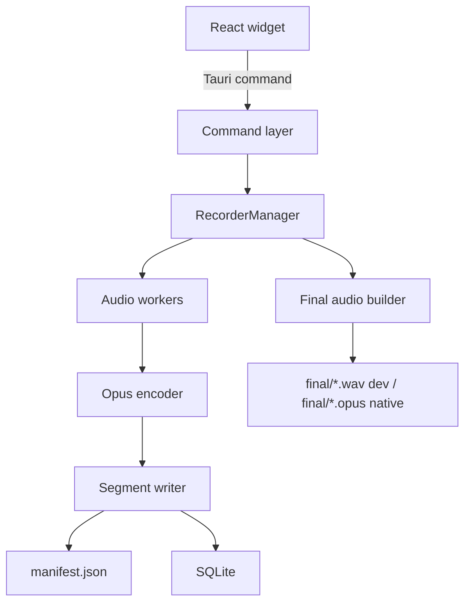

# Arquitectura

## Principios

- La UI no captura audio ni escribe archivos de grabacion.
- El core Rust controla sesiones, buffers, encoding, persistencia y recovery.
- Nunca se escribe directo al archivo final.
- Cada segmento se confirma con `flush`, `fsync`, rename atomico y registro en manifest/SQLite.
- El audio completo no vive en RAM.

## Flujo



## Estados visibles

```text
idle
starting
recording
paused
stopping
completed
recovering
error
```

## Eventos Tauri

```text
recorder://snapshot
recorder://recordings-changed
```

## Modulos Rust

- `commands.rs`: frontera Tauri.
- `recorder.rs`: ciclo de vida de grabacion.
- `storage.rs`: SQLite y queries.
- `manifest.rs`: manifest atomico.
- `paths.rs`: AppData y estructura local.
- `recovery.rs`: limpieza de `.tmp`, locks antiguos y sesiones interrumpidas.
- `finalizer.rs`: artefactos finales.
- `audio.rs`: dispositivos y futura captura nativa.

## Nota sobre el backend mock

La feature default `mock-audio` existe para desarrollar y probar UI, storage y recovery sin bloquearse por drivers, permisos o toolchain WASAPI. Genera WAV validos pero silenciosos. El contrato de archivos y estado queda listo para sustituir el payload por captura real y Ogg Opus.
